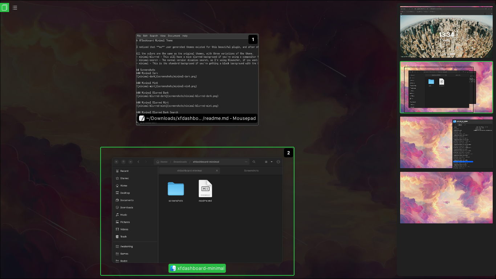
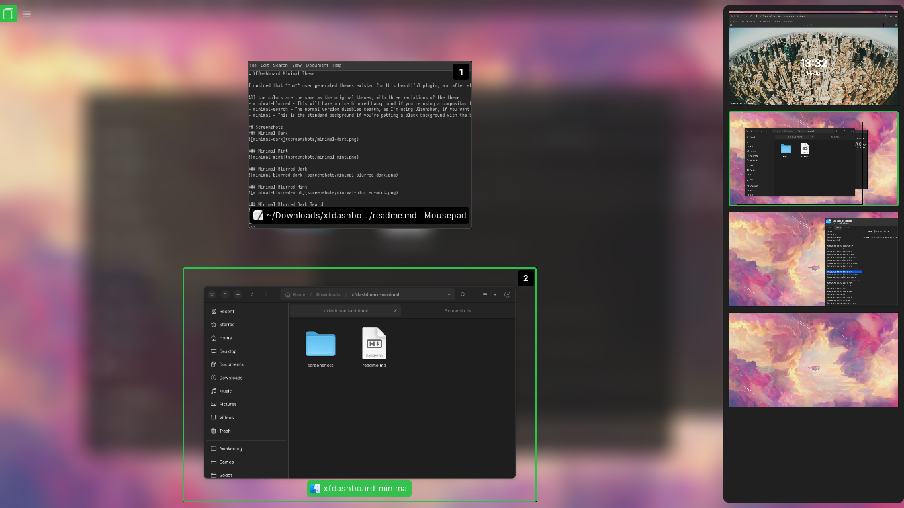
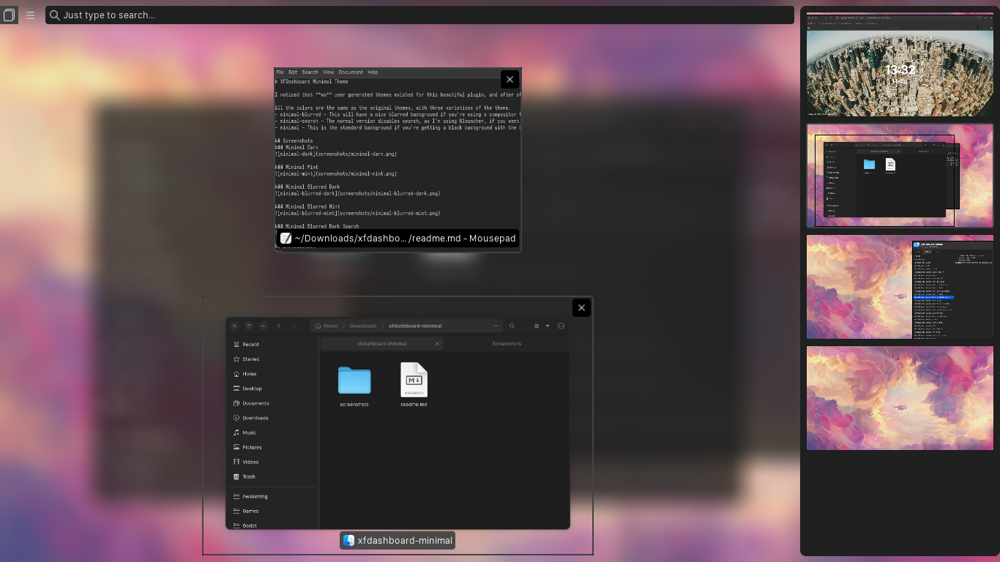

# XFDashboard Minimal Theme

I noticed that **no** user generated themes existed for this beautiful plugin, and after struggling to find a suitable alternative to Gnome Activities for XFCE, installing this, not liking how it looked, unninstalling it and reinstalling it several times, I decided to tinker with the theme files and came up with this.

All the colors are the same as the original themes, with three variations of the theme.
- minimal-blurred - This will have a nice blurred background if you're using a compositor that supports it like picom.
- minimal-search - The normal version disables search, as I'm using Ulauncher, if you want the search functionality, you can use any of the search variants.
- minimal - This is the standard background if you're getting a black background with the blurred variant.

## Screenshots
### Minimal Dark


### Minimal Mint


### Minimal Blurred Dark


### Minimal Blurred Mint


### Minimal Blurred Dark Search


## Installation
```
$ git clone https://github.com/Maysunfalls/XFDashboard-Minimal-Theme
$ cd XFDashboard-Minimal-Theme
$ sudo tar -xvf xfdashboard-minimal.tar.xz -C /usr/share/themes/
```
Open XFDashboard settings and try out your new themes.

## Extras
**HIGHLY RECOMMENDED TO RUN XFDASHBOARD IN DAEMON MODE**
### XFDashboard Launch Script
**REQUIRES xdotools**
This script allows the opening of XFDashboard through a shortcut, and then closing it if the shortcut is run again.
You can find this script in the extras folder, it's named *run.sh*.

Simply install xdotools if you don't have it already, and then place the script wherever you want. You can then assign a shortcut to run the script through Settings-Keyboard-Application Shortcuts. **DISCLAIMER:** *The script doesn't seem to work reliably this way, so I use a Fusuma shortcut instead.*

### Fusuma Shortcut
**REQUIRES Fusuma & xdotools & The launch script above**
You can find my full Fusuma config in the extras folder, it's named *full-config.yml*.
You can find the Fusuma config just containing the shortcut in the extras folder, it's named *lite-config.yml*.

Follow the steps above to setup the launch script, but don't assign a keyboard shortcut. Install and configure Fusuma. Either rename whichever of the config files you want to *config.yml*, or just copy the command from lite-config.yml and place it in your existing fusuma config. Go to /home/.config/fusuma/ If you're using my config, copy the renamed *config.yml* file into this folder. Open the config, and change the line: "path_to_launch_script/run.sh/", to wherever you placed the run.sh file in your own system. 

RESTART

##
Enjoy!